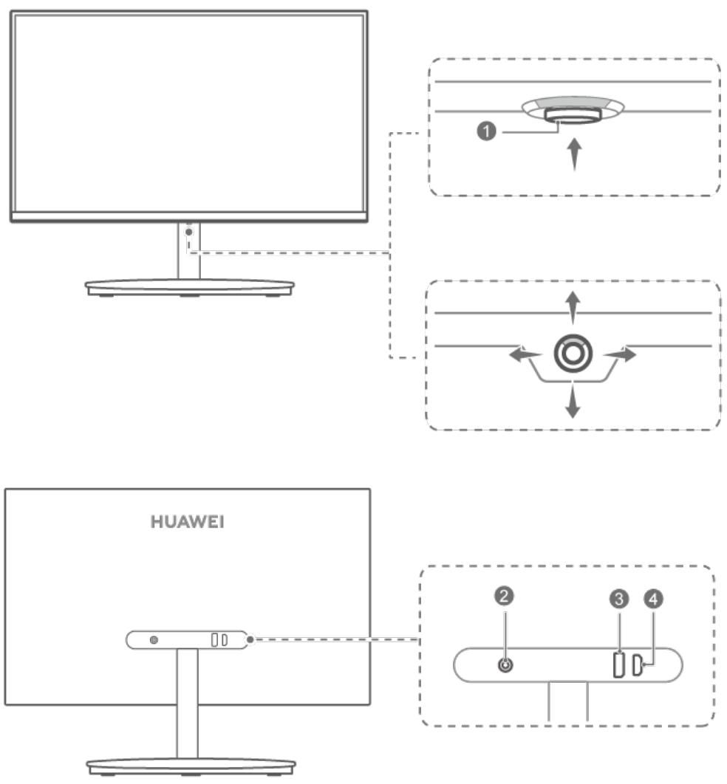
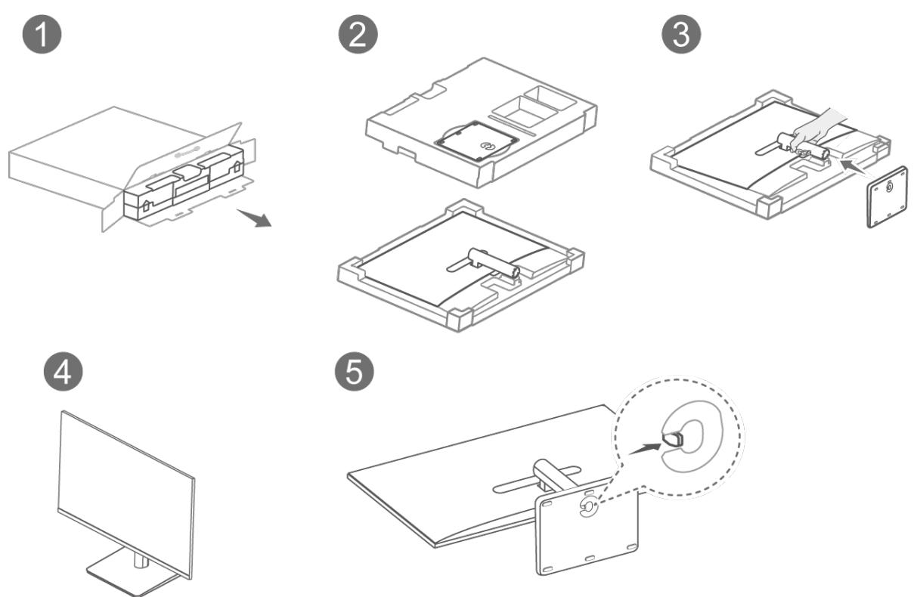
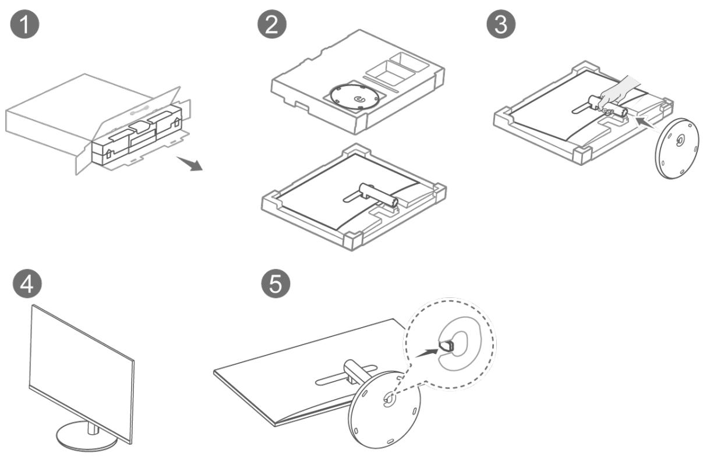
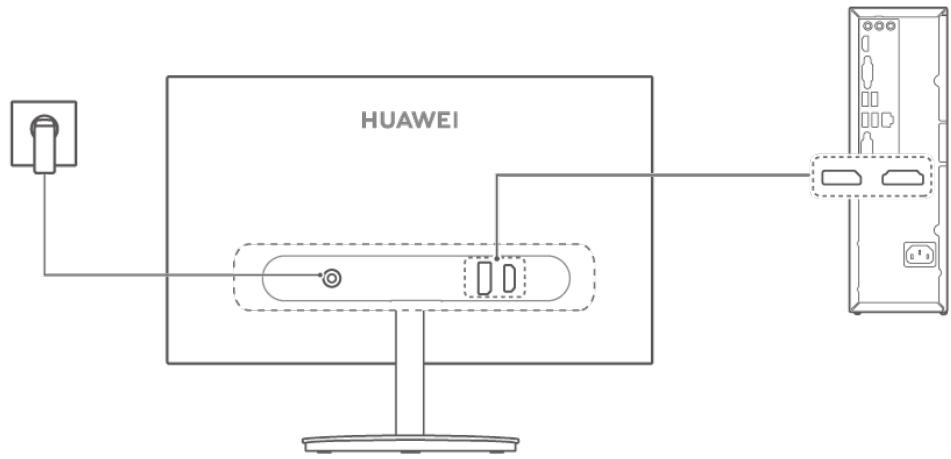
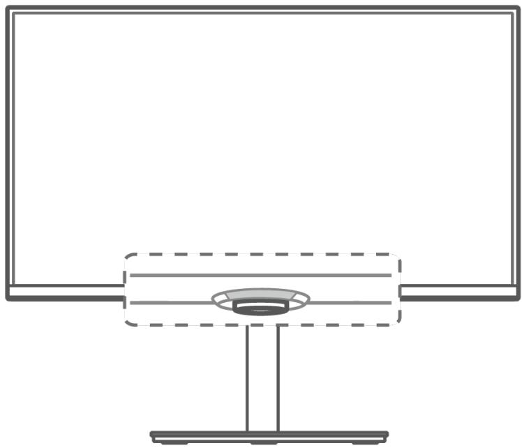

## 用户指南

## 目 录

关于本手册  
显示器外观和接口介绍  
安装与拆卸显示器  
显示器连接至计算机等设备  
使用五向摇杆按键开关机、 设置菜单  
显示器菜单选项  
支持的显示模式  
常见问题  
安全信息  
法律声明

## 关于本手册

使用设备前请仔细阅读本手册。

手册中展示的组件可能未包含在设备内，您需要单独购买；手册中描述的功能可能需要与其他组件配合，才能使用；手册中的图形、界面可能和实际有差异，所有图示仅供参考，请以实际产品为准。

## 显示器外观和接口介绍

<table><tr><td rowspan=1 colspan=1>序列号</td><td rowspan=1 colspan=1>按键功能</td></tr><tr><td rowspan=1 colspan=1>1</td><td rowspan=1 colspan=1>五向摇杆按键·向上短按此键开机，长按 2 秒以上关机。·开机状态下，向上、前、后、左、右短按均可调出菜单，向屏幕前、后、左、右短按可以设置菜单。更多内容，请参考章节使用五向摇杆按键开关机、设置菜单。</td></tr><tr><td rowspan=1 colspan=1>2</td><td rowspan=1 colspan=1>电源接口连接电源适配器，给显示器供电。</td></tr><tr><td rowspan=1 colspan=1>3</td><td rowspan=1 colspan=1>DP接口连接DP 输入设备，如计算机。</td></tr><tr><td rowspan=1 colspan=1>4</td><td rowspan=1 colspan=1>HDMI接口连接 HDMI 输入设备，如计算机。</td></tr></table>

## 安装与拆卸显示器

配置 SSNB-24

1 缓冲泡沫箭头朝上水平放置纸箱，打开纸箱包装，将整机和缓冲泡沫一起取出。

2 从缓冲泡沫中取出底座。

3 将显示器立柱稍微向上抬起，然后将底座安装到立柱下端，听到咔哒声表示已安装好。

4 将组装好的显示器用双手托起，立在平整的桌面上。可根据需要调整俯仰角度。

5 若要拆卸：将显示器平放在桌面上，一只手向内拨动底座的快拆拨片，同时另一只手握住立柱向外顶出底座，即可拆卸底座。

配置 SSNB-24BZ

1 缓冲泡沫箭头朝上水平放置纸箱，打开纸箱包装，将整机和缓冲泡沫一起取出。

2 从缓冲泡沫中取出底座。

3 将显示器立柱稍微向上抬起，然后将底座安装到立柱下端，听到咔哒声表示已安装好。

4 将组装好的显示器用双手托起，立在平整的桌面上。可根据需要调整俯仰角度。

5 若要拆卸：将显示器平放在桌面上，一只手向内拨动底座的快拆拨片，同时另一只手握住立柱向外顶出底座，即可拆卸底座。

## 显示器连接至计算机等设备

1 将 DP 线缆或 HDMI 线缆一端接入显示器的 DP 接口或 HDMI 接口，另一端接入计算机的DP 接口或 HDMI 接口。

2 将显示器和计算机的电源线等其他线缆连接好后开机，显示器屏幕上显示计算机的屏幕画面，代表连线成功。

## 使用五向摇杆按键开关机、设置菜单

显示器的五向摇杆按键可以作为电源键、菜单设置键使用，简单快捷设置显示器。

## 开启与关闭显示器：

• 开机：向上短按此键，显示器屏幕显示品牌 Logo 后，指示灯点亮，显示器开启。

显示器工作时，指示灯点亮；显示器无信号输入时，进入待机状态，若菜单中 LED 电源按钮设置为“待机模式时开”，待机状态下指示灯白色闪烁。

• 关机：向上长按此键 2 秒以上，指示灯熄灭，显示器关机。

## 设置显示器菜单：

1 显示器开机后，面向屏幕时，向上短按五向摇杆按键，打开显示器设置菜单。

2 在设置菜单界面，根据界面指示的手势操作五向摇杆按键，调节显示器的设置。

：面向屏幕时（下同），向屏幕前、后、左、右按五向摇杆按键，可移动切换选项。

：向左按五向摇杆按键，可返回至上一级菜单或退出菜单。

：向上或向右按五向摇杆按键，可确认选项。

## 显示器菜单选项

不同型号、不同版本的显示器、菜单选项存在差异，请以实际为准。

<table><tr><td>一级菜单</td><td>二级菜单</td><td>描述</td></tr><tr><td rowspan="5">情景模 式</td><td>P3 色彩</td><td>浏览 P3 广色域图片或喜好鲜艳色彩的人士，建议选择 P3 色彩。</td></tr><tr><td>SRGB 色彩</td><td>浏览计算机中的图片时，建议选择 sRGB 色彩。</td></tr><tr><td>HDR色彩 游戏</td><td>调色模拟 HDR 视频色彩效果，建议观赏影视场景使用。</td></tr><tr><td>电子书</td><td>游戏效果增强，建议游戏场景使用。 模拟纸质书籍效果，建议阅读场景使用。</td></tr><tr><td>用户</td><td>用户自定义显示效果。</td></tr><tr><td rowspan="8">显示  助</td><td>亮度</td><td>设置范围为 0-100。</td></tr><tr><td>对比度 0</td><td>设置范围为0-100。 此功能仅在用户/sRGB 色彩/P3 色彩模式下且关闭</td></tr><tr><td>锐利度</td><td>护眼模式，才可使用。</td></tr><tr><td>护眼</td><td>设置范围为0-100。 可开启或关闭护眼模式。 0 长期阅读时，建议开启护眼模式，预防用眼疲劳，使</td></tr><tr><td>色温</td><td>常现象。 此功能仅在用户/sRGB 色彩/P3 色彩模式下才可使 用，其余的情景模式下护眼模式默认为关。 可设置为冷色、中性色、标准色、暖色模式的一种。</td></tr><tr><td></td><td>或者在用户自定义选项中，对红、绿、蓝颜色分别设置，设 置数值为0-100。 0 此功能仅在用户/sRGB 色彩/P3 色彩模式下且关闭 护眼模式，才可使用。</td></tr><tr><td>缩放 HDMI</td><td>可选择满屏或等比缩放。</td></tr><tr><td rowspan="2">④ DP 输入源 刷新率 游戏辅 游戏准星</td><td>连接其他设备时，根据连接线缆，选择对应的输入源。</td></tr><tr><td>在游戏场景中，可以在此菜单中进行一些辅助设置。 开启后，可选择在屏幕左上角或右上角显示刷新率。 开启后，在屏幕上显示准星。并可将准星颜色设置为红色或</td></tr><tr><td colspan="1" rowspan="1"></td><td colspan="1" rowspan="1">响应时间</td><td colspan="1" rowspan="1">可开启或关闭响应时间。开启时，可选择标准、快、极快等响应时间。</td></tr><tr><td colspan="1" rowspan="2">快捷键</td><td colspan="1" rowspan="1">上</td><td colspan="1" rowspan="1">OSD快捷菜单上方的设置选项，默认为亮度，可设置为情景模式、响应时间、输入源、对比度等选项。</td></tr><tr><td colspan="1" rowspan="1">下</td><td colspan="1" rowspan="1">OSD快捷菜单下方的设置选项，默认为情景模式，可设置为亮度、响应时间、输入源、对比度等选项。</td></tr><tr><td colspan="1" rowspan="8">设置</td><td colspan="1" rowspan="1">语言</td><td colspan="1" rowspan="1">可设置为简体中文、美式英语、日语等其他语种。</td></tr><tr><td colspan="1" rowspan="2">菜单显示设置</td><td colspan="1" rowspan="1">菜单透明度：可设置菜单的显示透明度，设置数值为1-8，数字越大透明度越高。</td></tr><tr><td colspan="1" rowspan="1">菜单显示时间：可将菜单显示时间设置为 10-100 秒。</td></tr><tr><td colspan="1" rowspan="2">LED 电源按钮</td><td colspan="1" rowspan="1">待机模式时开：待机状态下，显示器的指示灯白色闪烁。</td></tr><tr><td colspan="1" rowspan="1">待机模式时关：待机状态下，显示器的指示灯熄灭。</td></tr><tr><td colspan="1" rowspan="1">信息</td><td colspan="1" rowspan="1">可查看显示器的 SN号、固件版本号、情景模式、分辨率、刷新率、输入源等信息。</td></tr><tr><td colspan="1" rowspan="1">ECO Mode</td><td colspan="1" rowspan="1">选择开启或关闭节能模式。此功能默认关闭，打开后会减少能耗。开启节能模式后，亮度等选项将无法设置。</td></tr><tr><td colspan="1" rowspan="1">恢复出厂设置</td><td colspan="1" rowspan="1">选择是否将显示器菜单恢复出厂设置。</td></tr></table>

## 支持的显示模式

最大分辨率

1920 x 1080 @ 75 Hz(HDMI)

1920 x 1080 @ 75 Hz(DP)

推荐分辨率

1920 x 1080 @ 60 Hz(HDMI)

1920 x 1080 @ 60 Hz(DP)

<table><tr><td rowspan=1 colspan=1>分辨率</td><td rowspan=1 colspan=1>HDMI刷新率</td><td rowspan=1 colspan=1>DP刷新率</td></tr><tr><td rowspan=1 colspan=1>640×480</td><td rowspan=1 colspan=1>60Hz</td><td rowspan=1 colspan=1>60Hz</td></tr><tr><td rowspan=1 colspan=1>640×480</td><td rowspan=1 colspan=1>67Hz</td><td rowspan=1 colspan=1>67Hz</td></tr><tr><td rowspan=1 colspan=1>640×480</td><td rowspan=1 colspan=1>72HZ</td><td rowspan=1 colspan=1>72HZ</td></tr><tr><td rowspan=1 colspan=1>640×480</td><td rowspan=1 colspan=1>75Hz</td><td rowspan=1 colspan=1>75Hz</td></tr><tr><td rowspan=1 colspan=1>720×400</td><td rowspan=1 colspan=1>70Hz</td><td rowspan=1 colspan=1>70Hz</td></tr><tr><td rowspan=1 colspan=1>800×600</td><td rowspan=1 colspan=1>56Hz</td><td rowspan=1 colspan=1>56Hz</td></tr><tr><td rowspan=1 colspan=1>800×600</td><td rowspan=1 colspan=1>60Hz</td><td rowspan=1 colspan=1>60Hz</td></tr><tr><td rowspan=1 colspan=1>800×600</td><td rowspan=1 colspan=1>72Hz</td><td rowspan=1 colspan=1>72Hz</td></tr><tr><td rowspan=1 colspan=1>800×600</td><td rowspan=1 colspan=1>75Hz</td><td rowspan=1 colspan=1>75Hz</td></tr><tr><td rowspan=1 colspan=1>832×624</td><td rowspan=1 colspan=1>75Hz</td><td rowspan=1 colspan=1>75Hz</td></tr><tr><td rowspan=1 colspan=1>1024×768</td><td rowspan=1 colspan=1>60Hz</td><td rowspan=1 colspan=1>60Hz</td></tr><tr><td rowspan=1 colspan=1>1024×768</td><td rowspan=1 colspan=1>70Hz</td><td rowspan=1 colspan=1>70Hz</td></tr><tr><td rowspan=1 colspan=1>1024×768</td><td rowspan=1 colspan=1>75Hz</td><td rowspan=1 colspan=1>75HZ</td></tr><tr><td rowspan=1 colspan=1>1280×1024</td><td rowspan=1 colspan=1>60Hz</td><td rowspan=1 colspan=1>60Hz</td></tr><tr><td rowspan=1 colspan=1>1280×1024</td><td rowspan=1 colspan=1>75Hz</td><td rowspan=1 colspan=1>75Hz</td></tr><tr><td rowspan=1 colspan=1>1280×720</td><td rowspan=1 colspan=1>60Hz</td><td rowspan=1 colspan=1>60Hz</td></tr><tr><td rowspan=1 colspan=1>1280×960</td><td rowspan=1 colspan=1>60Hz</td><td rowspan=1 colspan=1>60Hz</td></tr><tr><td rowspan=1 colspan=1>1440×900</td><td rowspan=1 colspan=1>60HZ</td><td rowspan=1 colspan=1>60Hz</td></tr><tr><td rowspan=1 colspan=1>1680×1050</td><td rowspan=1 colspan=1>60HZ</td><td rowspan=1 colspan=1>60Hz</td></tr><tr><td rowspan=1 colspan=1>1920×1080</td><td rowspan=1 colspan=1>60Hz</td><td rowspan=1 colspan=1>60Hz</td></tr><tr><td rowspan=1 colspan=1>1920×1080</td><td rowspan=1 colspan=1>75Hz</td><td rowspan=1 colspan=1>75HZ</td></tr></table>

## 常见问题

## 无法开机

• 检查显示器是否处于开机状态。

• 检查电源线是否正确连接到显示器和电源插座。

## 屏幕上无图像

• 检查所有线缆是否正确连接。

• 检查显示器和计算机主机是否均处于开机状态。

• 检查 DP/HDMI 等信号线是否出现损坏。

• 如果无上述问题，则重启设备，查看屏幕是否可正常显示图像。

## 屏幕太亮或太暗

• 打开显示器设置菜单，调节屏幕显示亮度和对比度。

## 屏幕颜色显示异常

• 检查 DP/HDMI 等信号线是否出现损坏，如插针弯曲。

• 打开显示器设置菜单，调整色温。

## 安全信息

在使用和操作设备前，为确保设备性能最佳，并避免出现危险或非法情况，请查阅并遵循所有的安全信息。

## 电子设备

有明文规定禁止使用无线设备的场所，请勿使用本设备，否则会干扰其它电子设备或导致其它危险。

## 对医疗设备的影响

• 在明文规定禁止使用无线设备的医疗和保健场所，请遵守该场所的规定，并关闭设备。

• 设备产生的无线电波可能会影响植入式医疗设备或个人医用设备的正常工作，如起搏器、植入耳蜗、助听器等。若您使用了这些医用设备，请向其制造商咨询使用本设备的限制条件。

• 在使用本设备时，请与植入的医疗设备（如起搏器、植入耳蜗等）保持至少 15 厘米的距离。

## 易燃易爆区域

• 在加油站（维修站）或靠近易燃物品、化学制剂等任何易燃易爆区域，请勿使用本设备，并遵守所有图形或文字的指示。在燃油或化学制剂存放和运输区或易爆场所内或周围，设备可能引起爆炸或起火。

• 请勿将设备及其配件与易燃液体、气体或易爆物品放在同一箱子中存放或运输。

## 操作环境

• 请勿在多灰、潮湿、肮脏或靠近磁场的地方使用设备，以免引起设备内部电路故障。

• 插拔设备线缆前，请先停止使用设备并断开电源。在插拔线缆时请保持双手干燥。

• 雷电天气请断开电源，并拔出连接在设备上的所有线缆，以免设备遭雷击损坏。

• 请勿在雷雨天气使用本设备。雷雨天气可能导致设备故障或电击危险。

• 请在温度 0℃～35℃ 范围内使用本设备，并在温度 -10℃～+45℃ 范围内存放设备及其配件。当环境温度过高或过低时，可能会引起设备故障。

• 请避免设备及其配件雨淋或受潮，否则可能导致火灾或触电危险。

• 请勿将设备靠近热源或裸露的火源，如电暖器、微波炉、烤箱、热水器、炉火、蜡烛或其他可能产生高温的地方。

• 设备在运行一段时间后，设备温度会升高。如果设备温度过高，请勿长时间接触，否则可能导致低温烫伤，引起皮肤红肿或色素沉淀。

• 请勿让儿童或宠物吞咬设备或其配件，以免对其造成伤害或导致设备故障或爆炸。

• 当不断重复同一动作时（例如玩游戏），您的手、臂、腕、肩、颈或其他身体部位可能会偶尔感觉不适。如果您感觉到不适，请停止使用并咨询医师。

• 请勿在设备上放置任何物体（如蜡烛、盛水容器等），若有异物或液体进入设备，请立刻停止使用并断开电源，拔出连接在设备上的所有线缆，并联系华为客户服务中心。

稳定性危险：本设备可能翻倒，造成严重人身伤害或死亡。采取诸如以下的简单的预防措施就能避免许多伤害，特别是对儿童的伤害：

• 始终使用本设备制造商建议的柜子或支架。

• 始终使用能安全支撑本设备的家具，始终确保本设备没有伸出该支撑家具的边缘。

• 从不把本设备放在不稳定的位置，从不将本设备放置在高的家具（例如橱柜或书柜）上。

• 务必布好连接到本设备上的电线和缆线，使其不会绊倒人、被拉扯或抓取。

• 切勿在本设备和支撑家具之间放置布料或其他材料。

• 务必让儿童了解攀爬家具到达本设备或其控制装置的危险。

• 切勿将玩具等可能诱使儿童攀爬的物品放在本设备顶部或放置本设备的家具上。

• 如果已有的设备需要保留并更换位置，请遵循相同的安全注意事项。

## 儿童健康

• 本设备及其配件可能包含一些小零件，请将设备及其配件放置在儿童接触不到的地方。儿童可能在无意之中损坏本设备及其配件，或吞下小零件导致窒息或其他危险。

• 本设备并非玩具，儿童应在成人监护下使用设备。

## 配件要求

• 使用未经认可或不兼容的电源、充电器或电池，可能引发火灾、爆炸或其他危险。

• 只能使用设备制造商认可且与此型号设备配套的配件。如果使用其他类型的配件，可能违反本设备的保修条款以及本设备所处国家的相关规定，并可能导致安全事故。如需获取认可的配件，请与华为客户服务中心联系。

## 电源安全

• 电源插头作为断开电源的装置。

• 电源插座应安装在设备附近并应易于触及。

• 当不使用本设备时，请断开电源与设备的连接并从电源插座上拔掉电源插头。

• 若电源插头或电源线已损坏，请勿继续使用，以免发生触电或火灾。

• 请勿用湿手触碰电源线，或用拉电源线缆的方式拔出电源。

• 请勿用湿手触摸设备或电源，以免发生设备短路、故障或触电。

## 维护和保养

• 不建议您自行升级部件或更换模块。如有相关服务需求，请联系华为客户服务中心。

• 请保持设备及其配件干燥。请勿使用微波炉或吹风机等外部加热设备对其进行干燥处理。

• 请勿在温度过高或过低区域放置设备及其配件，否则可能导致设备故障、着火或爆炸。

• 请勿使设备及其配件受到强烈的冲击或震动，以免损坏设备及其配件，导致设备故障。

• 清洁和维护前，请停止使用本设备，关闭所有应用，并断开与其他设备的所有连接或线缆。

• 请勿使用烈性化学制品、清洗剂或强洗涤剂清洁设备或其配件。请使用清洁、干燥的软布擦拭设备或其配件。

• 请勿将磁条卡（例如银行卡、电话卡等）长期接触本设备，否则可能导致磁条卡被磁场损坏。

• 如果设备碰撞硬物或设备受到外界的强烈撞击造成破碎，切勿触摸或试图移除破碎的部分，请立即停止使用并及时联系华为客户服务中心。

## 环境保护

• 请勿将本设备及其附件作为普通的生活垃圾处理。

• 请遵守本设备及其附件处理的本地法令，并支持回收行动。

## 法律声明

版权所有 © 华为 2022。保留一切权利。

本手册描述的产品中，可能包含华为及其可能存在的许可人享有版权的软件。除非获得相关权利人的许可，否则，任何人不能以任何形式对前述软件进行复制、分发、修改、摘录、反编译、反汇编、解密、反向工程、出租、转让、分许可等侵犯软件版权的行为，但是适用法禁止此类限制的除外。

## 商标声明

词语 HDMI、HDMI High-Definition Multimedia Interface（高清晰度多媒体接口）、HDMI商业外观和 HDMI 徽标均为 HDMI Licensing Administrator, Inc. 的商标或注册商标。

在本手册以及本手册描述的产品中，出现的其他商标、产品名称、服务名称以及公司名称，由其各自的所有人拥有。

## 开源声明

请访问 https://consumer.huawei.com/en/support/content/en-us15892133/ 查看开源软件声明的详细信息。

## 注意

本手册描述的产品及其附件的某些特性和功能，取决于当地网络的设计和性能，以及您安装的软件。某些特性和功能可能由于当地网络运营商或网络服务供应商不支持，或者由于当地网络的设置，或者您安装的软件不支持而无法实现。因此，本手册中的描述可能与您购买的产品或其附件并非完全一一对应。

华为保留随时修改本手册中任何信息的权利，无需提前通知且不承担任何责任。

## 责任限制

本手册中的内容均“按照现状”提供，除非适用法律要求，华为对本手册中的所有内容不提供任何明示或暗示的保证，包括但不限于适销性或者适用于某一特定目的的保证。

在适用法律允许的范围内，华为在任何情况下，都不对因使用本手册相关内容及本手册描述的产品而产生的任何特殊的、附带的、间接的、继发性的损害进行赔偿，也不对任何利润、数据、商誉或预期节约的损失进行赔偿。

在相关法律允许的范围内，在任何情况下，华为对您因为使用本手册描述的产品而遭受的损失的最大责任（除在涉及人身伤害的情况中根据适用的法律规定的损害赔偿外）以您购买本产品所支付的价款为限。

## 进出口管制

若需将本手册描述的产品（包括但不限于产品中的软件及技术数据等）出口、再出口或者进口，您应遵守适用的进出口管制法律法规。

## 隐私保护

为了解我们如何保护您的个人信息，请访问 https://consumer.huawei.com/privacy-policy 阅读我们的隐私政策。

本指南仅供参考，不构成任何形式的承诺，产品（包括但不限于颜色、大小、屏幕显示等）请以实物为准。如出现本指南与官网描述不一致的情况，请以官网说明为准，恕不另行通知。